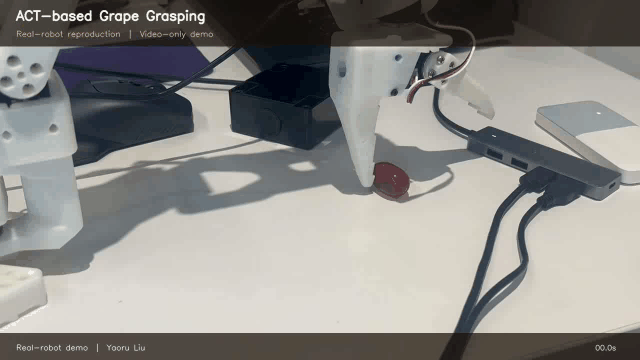
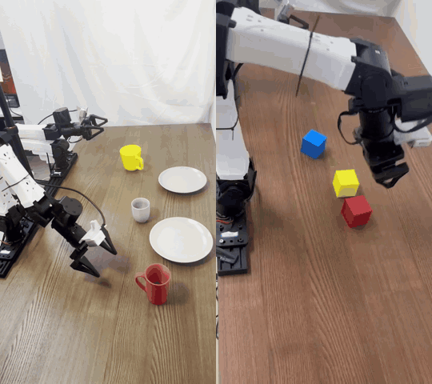

# Hi, I'm Yaoru Liu

I am a mathematics-trained robotics researcher interested in **real-world robot learning, VR teleoperation, imitation learning, and high-frequency control**. My work focuses on turning research ideas into reliable real-robot systems.

## Featured projects

### OpenArm VR Teleoperation Bridge

I developed the real-time integration layer that converts third-party `teleop_xr` IK targets into filtered, rate-limited, and safety-monitored DaMiao MIT CAN commands for a physical 14-DOF OpenArm platform.

[Code and documentation](https://github.com/haskfja/openarm-vr-teleop-bridge) · [Primary object-manipulation demo](https://github.com/haskfja/openarm-vr-teleop-bridge/blob/main/assets/openarm-bimanual-object-manipulation.mp4) · [Previous VR demo](https://github.com/haskfja/openarm-vr-teleop-bridge/blob/main/assets/openarm-vr-demo.mp4)

### UR5e VR Teleoperation

VR position/orientation mapping, MuJoCo motion validation, and real-time UR5e control using a 25 Hz VR input and a 125 Hz RTDE control loop.

[Code and documentation](https://github.com/haskfja/ur5e-vr-teleoperation) · [Full demo](https://github.com/haskfja/ur5e-vr-teleoperation/blob/main/assets/ur5e-vr-demo.mp4)

### ACT-based Grape Grasping

Real-robot reproduction of an ACT-based imitation-learning pipeline for delicate grape grasping. This is presented as a **video-only reproduction demo** because the original training code and dataset are no longer available.

[Watch the full demo](assets/act-grape-grasping-demo.mp4)

### π0.5 Full Fine-Tuning — Language-Conditioned Pick-and-Place

I performed **full fine-tuning** of the **π0.5** vision-language-action policy ([openpi](https://github.com/Physical-Intelligence/openpi)) end-to-end on teleoperated real-robot demonstrations, and deployed it **fully autonomously** on an **i2RT YAM arm** for language-conditioned (English instruction) pick-and-place — mugs to plates and cube stacking — with high success rates. Training code and dataset are not publicly available.

[Watch the full demo](assets/pi05-pick-and-place-demo.mp4)

## Technical focus

`Python` · `PyTorch` · `MuJoCo` · `UR RTDE` · `CAN / CAN FD` · `VR teleoperation` · `Imitation learning`

## Contact

Beijing, China · yaoruliu@bjfu.edu.cn
